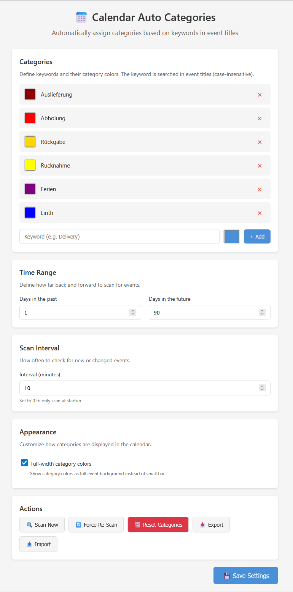
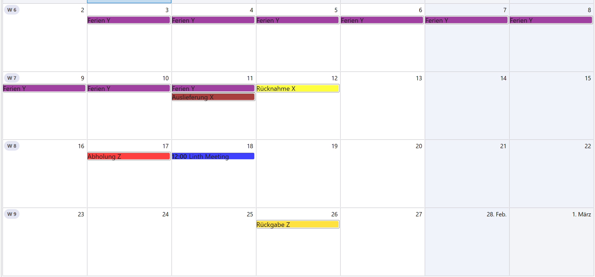

# 📅 Calendar Auto Categories

A Thunderbird add-on that automatically assigns categories (with colors) to calendar events based on keywords in the event title.

[](https://www.thunderbird.net/)
[](https://opensource.org/licenses/MPL-2.0)

## ✨ Features

- **Automatic categorization** – Events are categorized based on keywords in their title
- **Custom colors** – Define your own category colors for visual distinction
- **Full-width colors** – Optional full event background coloring (not just a small bar)
- **Configurable time range** – Set how far back and forward to scan
- **Periodic scanning** – Automatically checks for new events at configurable intervals
- **Import/Export** – Backup and share your configuration

## 📸 Screenshots

| Settings | Calendar View |
|----------|---------------|
|  |  |


## 📦 Installation

### From Release (Recommended)
1. Download the latest `.xpi` file from [Releases](https://github.com/ces-repo/calendar-auto-categories/releases)
2. In Thunderbird: **Tools** → **Add-ons and Themes**
3. Click the ⚙️ gear icon → **Install Add-on From File...**
4. Select the downloaded `.xpi` file

### From Source
```bash
git clone https://github.com/ces-repo/calendar-auto-categories.git
cd calendar-auto-categories
zip -r calendar_auto_categories.xpi manifest.json background.js api/ options/ icons/
```

## ⚙️ Configuration

Open the add-on settings: **Tools** → **Add-ons and Themes** → **Calendar Auto Categories** → **Options**

### Categories

Define keywords and their colors. When an event title contains a keyword (case-insensitive), the corresponding category is automatically assigned.

> **Note:** The add-on ships with example categories (Meeting, Deadline, Urlaub, Wichtig, Privat) to demonstrate functionality. **These are just examples** – customize them to match your own workflow!

**Example configurations:**

| Use Case | Keywords |
|----------|----------|
| Project Management | `Meeting`, `Deadline`, `Review`, `Sprint` |
| Personal | `Birthday`, `Doctor`, `Vacation`, `Gym` |
| Business | `Client`, `Internal`, `Travel`, `Training` |

### Time Range

- **Days in the past**: How many days back to scan (default: 1)
- **Days in the future**: How many days forward to scan (default: 90)

### Scan Interval

How often to check for new or changed events (default: 10 minutes). Set to 0 to only scan at Thunderbird startup.

### Appearance

- **Full-width category colors**: When enabled, the category color fills the entire event background instead of showing as a small colored bar.

## 🔧 Actions

| Button | Description |
|--------|-------------|
| **Scan Now** | Immediately scan events and apply categories |
| **Force Re-Scan** | Re-apply categories to ALL events (even already categorized ones) |
| **Reset Categories** | Remove all categories created by this add-on |
| **Export** | Save your configuration as JSON |
| **Import** | Load a previously exported configuration |

## 🔒 Privacy

This add-on:
- Works entirely locally within Thunderbird
- Does not send any data to external servers
- Does not require an internet connection
- Only accesses your calendar data to apply categories

## 🐛 Troubleshooting

**Categories not appearing?**
1. Check that your keywords match text in event titles
2. Try "Force Re-Scan" to re-process all events
3. Ensure the time range covers the events you expect

**Colors not showing as full background?**
- Enable "Full-width category colors" in settings
- Some calendar views may not support full-width colors

**Add-on not compatible?**
- Check that you have Thunderbird 115 or newer
- Download the latest release which supports newer TB versions

## 🤝 Contributing

Contributions are welcome! Feel free to:
- Report bugs via [Issues](https://github.com/ces-repo/calendar-auto-categories/issues)
- Submit feature requests
- Create pull requests

## 📄 License

This project is licensed under the Mozilla Public License 2.0 - see the [LICENSE](LICENSE) file for details.

## 📋 Changelog

### v1.5.0
- ✅ Thunderbird 147+ support (strict_max_version raised to 160)
- 🔄 Changed default categories to universal examples
- 🔗 Updated repository links

### v1.4.2
- Initial public release
- Full-width color support
- Import/Export functionality

---

Made with ❤️ for the Thunderbird community
